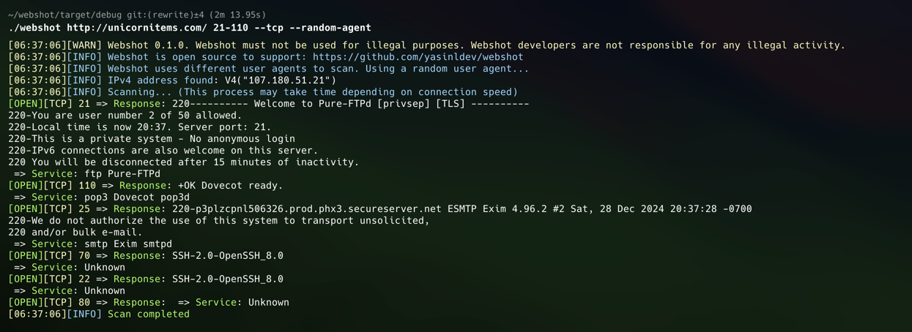

# Webshot

Webshot is a simple port and service scanner written in Rust. It is designed to be fast and easy to use. It is also designed to be easily extensible.

## Usage

```
webshot https://example.com 
webshot https://example.com 80-1024 
webshot 2606:2800:21f:cb07:6820:80da:af6b:8b2c --ipv6 80-1024
```

## Parameters

Please use the `--help` flag to see the available parameters.

## Screenshots



## Installation

First, you need to have Rust installed. You can install Rust by following the instructions [here](https://www.rust-lang.org/tools/install).

Then, you can install Webshot by running the following command:

```
git clone https://github.com/yasinldev/webshot.git
cd webshot
cargo build --release
```

The binary will be located at `target/release/webshot`.

## License

This project is licensed under the GPL-3.0 License - see the [LICENSE](LICENSE) file for details.
